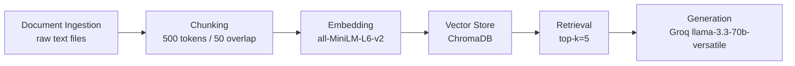

# Project 1 Planning: The Unofficial Guide

> Write this document before you write any pipeline code.
> Your spec and architecture diagram are what you'll use to direct AI tools (Claude, Copilot, etc.) to generate your implementation — the more specific they are, the more useful the generated code will be.
> Update the Retrieval Approach and Chunking Strategy sections if you change your approach during implementation.
> Update this file before starting any stretch features.

---

## Domain

Northeastern University co-op experiences shared by students across Reddit, Medium, and other platforms. This knowledge is hard to find otherwise because it's scattered across dozens of sources and not aggregated anywhere officially.

---

## Documents

<!-- List your specific sources: URLs, subreddit names, forum threads, or file descriptions.
     Aim for at least 10 sources that together cover different subtopics or perspectives within your domain. -->

| # | Source | Description | URL or location |
|---|--------|-------------|-----------------|
| 1 | r/NEU Reddit | Student co-op search and experience threads | https://www.reddit.com/r/NEU/search/?q=co-op |
| 2 | r/NEU Reddit | More specific co-op experience threads | https://www.reddit.com/r/NEU/search/?q=coop+experience |
| 3 | Northeastern Experience Magazine | Students sharing co-op experiences | https://experiencepoweredby.northeastern.edu/cooperative-education/page/2/ |
| 4 | Northeastern News | What is the co-op experience article | https://news.northeastern.edu/2024/03/25/co-op-experience/ |
| 5 | COE Graduate Ambassadors Blog | Student co-op reflections and stories | https://coegraduatestudentambassadors.sites.northeastern.edu/the-blog/page/4 |
| 6 | Medium - Mingle Li | Top 10 tips from first co-op search, mistakes and advice | https://medium.com/@minglethepringle/top-ten-tips-for-northeastern-university-co-op-b6fb7dfd0eee |
| 7 | Medium - Serena Wang | International student perspective on co-op | https://medium.com/@serenawang0210/behind-northeasterns-co-op-program-f4265614127a |
| 8 | Medium - Tiffany Nguyen | Honest review from Class of 2025 business graduate | https://medium.com/@tiffanyn.3544/my-honest-northeastern-experience-personal-perspective-22f66e918ce7 |
| 9 | Medium - Grace Yeung | NEU senior guide to co-op, PM and BA experience | https://graceyg.medium.com/demystifying-college-co-ops-what-is-it-how-do-i-get-one-421544a637b2 |
| 10 | Huntington News | Student newspaper article with candid co-op experiences | https://huntnewsnu.com/82523/campus/115-years-later-how-northeasterns-co-op-program-grew-with-the-university/ |

---

## Chunking Strategy

<!-- How will you split documents into chunks?
     State your chunk size (in tokens or characters), overlap size, and explain why those
     numbers fit the structure of your documents.
     A review-heavy corpus warrants different chunking than a long FAQ. -->

**Chunk size:** 500 tokens

**Overlap:** 50 tokens

**Reasoning:** Co-op reviews are short and conversational, so smaller chunks keep individual experiences intact without splitting mid-thought

---

## Retrieval Approach

<!-- Which embedding model are you using (e.g., all-MiniLM-L6-v2 via sentence-transformers)?
     How many chunks will you retrieve per query (top-k)?
     If you were deploying this for real users and cost wasn't a constraint, what tradeoffs
     would you weigh in choosing a different embedding model — context length, multilingual
     support, accuracy on domain-specific text, latency? -->

**Embedding model:** all-MiniLM-L6-v2 via sentence-transformers

**Top-k:** 5

**Production tradeoff reflection:** If cost wasn't a constraint, I would consider OpenAI's text-embedding-3-large for better accuracy on domain-specific text like co-op reviews. The tradeoffs would be: higher accuracy and better semantic understanding vs. higher latency and API cost per query. For a multilingual use case (international NU students), a multilingual model like paraphrase-multilingual-MiniLM-L12-v2 would be worth exploring despite the added complexity

---

## Evaluation Plan

<!-- List your 5 test questions with their expected correct answers.
     Questions should be specific enough that you can judge whether the system's response
     is right or wrong. "What are good dining halls?" is too vague.
     "What do students say about wait times at [dining hall name] during lunch?" is testable. -->

| # | Question | Expected answer |
|---|----------|-----------------|
| 1 | What is the average co-op pay at Northeastern? | Around $26/hr based on student reports |
| 2 | Is co-op required at Northeastern? | No, but highly encouraged, almost all students do it |
| 3 | What mistakes do students make during their first co-op search? | Focusing too much on pay rather than experience |
| 4 | What companies have NU students co-oped at in healthcare? | Mass General, Brigham and Women's, Boston Children's Hospital |
| 5 | How long is a co-op at Northeastern? | Six months full-time |

---

## Anticipated Challenges

<!-- What could go wrong? Name at least two specific risks with reasoning.
     Consider: noisy or inconsistent documents, missing source attribution, off-topic
     retrieval, chunks that split key information across boundaries. -->

1. Noisy or inconsistent documents: Blog posts and Reddit threads vary widely in structure and length, making it hard to chunk them consistently. Some reviews are one sentence, others are full paragraphs -> this may cause uneven retrieval quality.

2. Off-topic retrieval: Some sources discuss co-op generally (tips, process) rather than specific experiences, so the system may retrieve irrelevant chunks when asked about a specific company or role.

---

## Architecture

<!-- Draw a diagram of your pipeline showing the five stages:
     Document Ingestion → Chunking → Embedding + Vector Store → Retrieval → Generation
     Label each stage with the tool or library you're using.
     You can use ASCII art, a Mermaid diagram, or embed a sketch as an image.
     You'll use this diagram as context when prompting AI tools to implement each stage. -->

---

## AI Tool Plan

<!-- For each part of the pipeline below, describe:
     - Which AI tool you plan to use (Claude, Copilot, ChatGPT, etc.)
     - What you'll give it as input (which sections of this planning.md, which requirements)
     - What you expect it to produce
     - How you'll verify the output matches your spec

     "I'll use AI to help me code" is not a plan.
     "I'll give Claude my Chunking Strategy section and ask it to implement chunk_text()
     with my specified chunk size and overlap" is a plan. -->

**Milestone 3 — Ingestion and chunking:** Use Claude. Input: this planning.md with chunking strategy section. Expect it to produce Python code that reads text files from the documents/ folder and splits them into 500-token chunks with 50-token overlap. Verify by printing chunk count and a sample chunk.

**Milestone 4 — Embedding and retrieval:** Use Claude. Input: chunking code + retrieval approach section. Expect code that embeds chunks using all-MiniLM-L6-v2 and stores them in ChromaDB, then retrieves top-5 chunks for a query. Verify by running a test query and checking returned chunks are relevant.

**Milestone 5 — Generation and interface:** Use Claude. Input: retrieval code + architecture diagram. Expect code that passes retrieved chunks to Groq llama-3.3-70b and returns a final answer. Verify by running the 5 evaluation questions and checking answers match expected.
